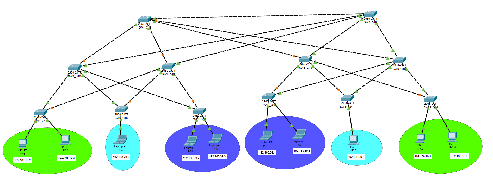
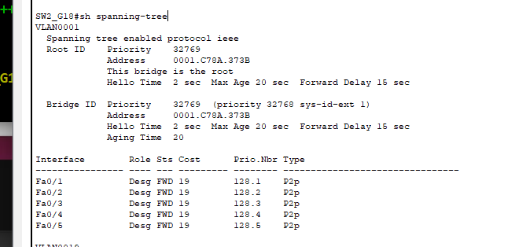

# REDES2_2S2023_G18
Práctica 1 del curso Redes de Computadoras 2:
# Topologia


## Detalle del dispositivos
| Dispositivo | IP | VLAN |
|-------------|-------------|-------------|
| PC1  | 192.168.19.2  | vlan 19   |
| PC2  | 192.168.19.3  | vlan 19   |
| PC3  | 192.168.29.2  | vlan 29   |
| PC4  | 192.168.39.2  | vlan 39   |
| PC5  | 192.168.39.3  | vlan 39   |
| PC6  | 192.168.39.4  | vlan 39   |
| PC7  | 192.168.39.5  | vlan 39   |
| PC8  | 192.168.29.5  | vlan 29   |
| PC9  | 192.168.19.4  | vlan 19   |
| PC10  | 192.168.19.5  | vlan 19   |

## Configuracion de VTP
### SW1
```
enable
configure terminal
hostname SW1_G18
interface range f0/1-5
switchport mode trunk
switchport trunk allowed vlan all
no shutdown
exit
vlan 19
name PRIMARIA19
exit
vlan 29
name BASICOS29
vlan 39
name DIVERSIFICADO39
exit
vtp domain g18
vtp password redes2sgrupo18
vtp mode server
exit
sh vlan brief
copy running-config startup-config
```

### SW2
```
enable
configure terminal
hostname SW2_G18
interface range f0/1-5
switchport trunk allowed vlan all
switchport mode trunk
no shutdown
exit
vtp domain g18
vtp password redes2sgrupo18
vtp mode client
exit
sh vlan brief
copy running-config startup-config
```

### SW3
```
enable
configure terminal
hostname SW3_G18
interface range f0/1-5
switchport mode trunk
switchport trunk allowed vlan all
no shutdown
exit
vlan 19
name PRIMARIA19
exit
vlan 29
name BASICOS29
vlan 39
name DIVERSIFICADO39
exit
vtp domain g18
vtp password redes2sgrupo18
vtp mode server
exit
sh vlan brief
copy running-config startup-config
```
### SW4
```
enable
configure terminal
hostname SW4_G18
interface range f0/1-5
switchport trunk allowed vlan all
switchport mode trunk
no shutdown
exit
vtp domain g18
vtp password redes2sgrupo18
vtp mode client
exit
sh vlan brief
copy running-config startup-config
```
### SW5
```
enable
configure terminal
hostname SW5_G18
interface range f0/1-2
switchport trunk allowed vlan all
switchport mode trunk
no shutdown
interface range f0/3-4
swtichport mode access
switchport access vlan 19
no shutdown
vtp domain g18
vtp password redes2sgrupo18
vtp mode client
exit
sh vlan brief
copy running-config startup-config
```
### SW6
```
enable
configure terminal
hostname SW6_G18
interface range f0/1-2
switchport trunk allowed vlan all
switchport mode trunk
no shutdown
interface f0/3
swtichport mode access
switchport access vlan 29
no shutdown
vtp domain g18
vtp password redes2sgrupo18
vtp mode client
exit
sh vlan brief
copy running-config startup-config
```

### SW7
```
enable
configure terminal
hostname SW7_G18
interface range f0/1-2
switchport trunk allowed vlan all
switchport mode trunk
no shutdown
interface range f0/3-4
switchport mode access
switchport access vlan 39
no shutdown
vtp domain g18
vtp password redes2sgrupo18
vtp mode client
exit
sh vlan brief
copy running-config startup-config
```
### SW8
```
enable
configure terminal
hostname SW8_G18
interface range f0/1-5
switchport trunk allowed vlan all
switchport mode trunk
no shutdown
exit
vtp domain g18
vtp password redes2sgrupo18
vtp mode client
exit
sh vlan brief
copy running-config startup-config
```
### SW9
```
enable
configure terminal
hostname SW9_G18
interface range f0/1-5
switchport mode trunk
switchport trunk allowed vlan all
no shutdown
exit
vlan 19
name PRIMARIA19
exit
vlan 29
name BASICOS29
vlan 39
name DIVERSIFICADO39
exit
vtp domain g18
vtp password redes2sgrupo18
vtp mode server
exit
sh vlan brief
copy running-config startup-config
```
### SW10
```
enable
configure terminal
hostname SW10_G18
interface range f0/1-2
switchport trunk allowed vlan all
switchport mode trunk
no shutdown
interface range f0/3-4
switchport mode access
switchport access vlan 39
no shutdown
vtp domain g18
vtp password redes2sgrupo18
vtp mode client
exit
sh vlan brief
copy running-config startup-config
```

### SW11
```
enable
configure terminal
hostname SW11_G18
interface range f0/1-2
switchport trunk allowed vlan all
switchport mode trunk
no shutdown
interface f0/3
switchport mode access
switchport access vlan 29
no shutdown
vtp domain g18
vtp password redes2sgrupo18
vtp mode client
exit
sh vlan brief
copy running-config startup-config
```

### SW12
```
enable
configure terminal
hostname SW12_G18
interface range f0/1-2
switchport trunk allowed vlan all
switchport mode trunk
no shutdown
interface range f0/3-4
switchport mode access
switchport access vlan 19
no shutdown
vtp domain g18
vtp password redes2sgrupo18
vtp mode client
exit
sh vlan brief
copy running-config startup-config
```
## Configuracion de STP

### Identificacion del dispositivo raiz

