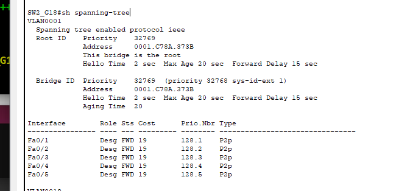

# Redes 2 Practica 1 Grupo 18

## Integrantes
| Nombre | Carnet |
|-------------|-------------|
| Erick Omar Letona Figueroa  | 201700377  |
| Denilson Florentin de Leon Aguilar  | 201830313  |

Práctica 1 del curso Redes de Computadoras 2:
# Topologia


## Detalle del dispositivos
| Dispositivo | IP | MAC ADRESS |
|-------------|-------------|-------------|
| PC1  | 192.168.19.2  | 0030.F21E.1C0E   |
| PC2  | 192.168.19.3  | 00D0.BC49.1A17   |
| PC3  | 192.168.29.2  | 0060.70A6.4390   |
| PC4  | 192.168.39.2  | 0004.9AD9.B9D3   |
| PC5  | 192.168.39.3  | 0001.C98E.A614  |
| PC6  | 192.168.39.4  | 0010.11C9.AAE7  |
| PC7  | 192.168.39.5  | 00D0.FF22.1698   |
| PC8  | 192.168.29.5  | 000A.F359.2D83  |
| PC9  | 192.168.19.4  | 0060.4724.2300  |
| PC10  | 192.168.19.5  | 0060.5CED.80BA   |

## Configuracion de VTP
### SW1
```
enable
configure terminal
hostname SW1_G18
interface range f0/1-5
switchport mode trunk
switchport trunk allowed vlan all
no shutdown
exit
vlan 19
name PRIMARIA19
exit
vlan 29
name BASICOS29
vlan 39
name DIVERSIFICADO39
exit
vtp domain g18
vtp password redes2sgrupo18
vtp mode server
exit
sh vlan brief
copy running-config startup-config
```

### SW2
```
enable
configure terminal
hostname SW2_G18
interface range f0/1-5
switchport trunk allowed vlan all
switchport mode trunk
no shutdown
exit
vtp domain g18
vtp password redes2sgrupo18
vtp mode client
exit
sh vlan brief
copy running-config startup-config
```

### SW3
```
enable
configure terminal
hostname SW3_G18
interface range f0/1-5
switchport mode trunk
switchport trunk allowed vlan all
no shutdown
exit
vlan 19
name PRIMARIA19
exit
vlan 29
name BASICOS29
vlan 39
name DIVERSIFICADO39
exit
vtp domain g18
vtp password redes2sgrupo18
vtp mode server
exit
sh vlan brief
copy running-config startup-config
```
### SW4
```
enable
configure terminal
hostname SW4_G18
interface range f0/1-5
switchport trunk allowed vlan all
switchport mode trunk
no shutdown
exit
vtp domain g18
vtp password redes2sgrupo18
vtp mode client
exit
sh vlan brief
copy running-config startup-config
```
### SW5
```
enable
configure terminal
hostname SW5_G18
interface range f0/1-2
switchport trunk allowed vlan all
switchport mode trunk
no shutdown
interface range f0/3-4
swtichport mode access
switchport access vlan 19
no shutdown
vtp domain g18
vtp password redes2sgrupo18
vtp mode client
exit
sh vlan brief
copy running-config startup-config
```
### SW6
```
enable
configure terminal
hostname SW6_G18
interface range f0/1-2
switchport trunk allowed vlan all
switchport mode trunk
no shutdown
interface f0/3
swtichport mode access
switchport access vlan 29
no shutdown
vtp domain g18
vtp password redes2sgrupo18
vtp mode client
exit
sh vlan brief
copy running-config startup-config
```

### SW7
```
enable
configure terminal
hostname SW7_G18
interface range f0/1-2
switchport trunk allowed vlan all
switchport mode trunk
no shutdown
interface range f0/3-4
switchport mode access
switchport access vlan 39
no shutdown
vtp domain g18
vtp password redes2sgrupo18
vtp mode client
exit
sh vlan brief
copy running-config startup-config
```
### SW8
```
enable
configure terminal
hostname SW8_G18
interface range f0/1-5
switchport trunk allowed vlan all
switchport mode trunk
no shutdown
exit
vtp domain g18
vtp password redes2sgrupo18
vtp mode client
exit
sh vlan brief
copy running-config startup-config
```
### SW9
```
enable
configure terminal
hostname SW9_G18
interface range f0/1-5
switchport mode trunk
switchport trunk allowed vlan all
no shutdown
exit
vlan 19
name PRIMARIA19
exit
vlan 29
name BASICOS29
vlan 39
name DIVERSIFICADO39
exit
vtp domain g18
vtp password redes2sgrupo18
vtp mode server
exit
sh vlan brief
copy running-config startup-config
```
### SW10
```
enable
configure terminal
hostname SW10_G18
interface range f0/1-2
switchport trunk allowed vlan all
switchport mode trunk
no shutdown
interface range f0/3-4
switchport mode access
switchport access vlan 39
no shutdown
vtp domain g18
vtp password redes2sgrupo18
vtp mode client
exit
sh vlan brief
copy running-config startup-config
```

### SW11
```
enable
configure terminal
hostname SW11_G18
interface range f0/1-2
switchport trunk allowed vlan all
switchport mode trunk
no shutdown
interface f0/3
switchport mode access
switchport access vlan 29
no shutdown
vtp domain g18
vtp password redes2sgrupo18
vtp mode client
exit
sh vlan brief
copy running-config startup-config
```

### SW12
```
enable
configure terminal
hostname SW12_G18
interface range f0/1-2
switchport trunk allowed vlan all
switchport mode trunk
no shutdown
interface range f0/3-4
switchport mode access
switchport access vlan 19
no shutdown
vtp domain g18
vtp password redes2sgrupo18
vtp mode client
exit
sh vlan brief
copy running-config startup-config
```
## Configuracion de STP

### Identificacion del dispositivo raiz

Identificamos a SW2 como el dispositivo raiz 



### Tiempos de convergencia

| Protocolo | Primaria (minutos) | Basicos (minutos) | Diversificado (minutos)|
|-------------|-------------|-------------|-------------|
| STP  | 1.49.89  | 2.46.35  | 2.30.45  |
| PVST  | 1.44.88  |  2.38.33 | 2.22.58  |
| Rapid PVST  | 0.02 | 0.0   | 0.0  |

#### ***Se determino que el protocolo con un tiempo de convergencia menor es Rapid PVST***

#### Configuracion de PVST
### SW1, SW2, SW3, SW4, SW5, SW6, SW7, SW8, SW9, SW10, SW11, SW12
```
enable
config t
spanning-tree mode pvst
exit
copy running-config startup-config
```
#### Configuracion de Rapid PVST
### SW1, SW2, SW3, SW4, SW5, SW6, SW7, SW8, SW9, SW10, SW11, SW12
```
enable
config t
spanning-tree mode rapid-pvst
exit
copy running-config startup-config
```

## Configuracion de Port Security
### SW5
```
config t
int f0/3
switchport port-security
switchport port-security mac-address 0030.F21E.1C0E
switchport port-security violation shutdown
exit
int f0/4
switchport port-security
switchport port-security mac-address 00D0.BC49.1A17
switchport port-security violation shutdown
exit
exit
copy running-config startup-config
```
### SW6
```
config t
int f0/3
switchport port-security
switchport port-security mac-address 0060.70A6.4390
switchport port-security violation shutdown
exit
exit
copy running-config startup-config
```
### SW7
```
config t
int f0/3
switchport port-security
switchport port-security mac-address 0004.9AD9.B9D3
switchport port-security violation shutdown
exit
int f0/4
switchport port-security
switchport port-security mac-address 0001.C98E.A614
switchport port-security violation shutdown
exit
exit
copy running-config startup-config
```
### SW10
```
config t
int f0/3
switchport port-security
switchport port-security mac-address 0010.11C9.AAE7
switchport port-security violation shutdown
exit
int f0/4
switchport port-security
switchport port-security mac-address 00D0.FF22.1698
switchport port-security violation shutdown
exit
exit
copy running-config startup-config
```
### SW11
```
config t
int f0/3
switchport port-security
switchport port-security mac-address 000A.F359.2D83
switchport port-security violation shutdown
exit
exit
copy running-config startup-config
```
### SW12
```
config t
int f0/3
switchport port-security
switchport port-security mac-address 0060.4724.2300
switchport port-security violation shutdown
exit
int f0/4
switchport port-security
switchport port-security mac-address 0060.5CED.80BA
switchport port-security violation shutdown
exit
exit
copy running-config startup-config
```
